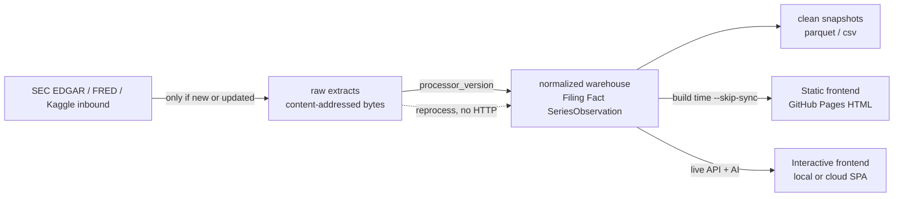
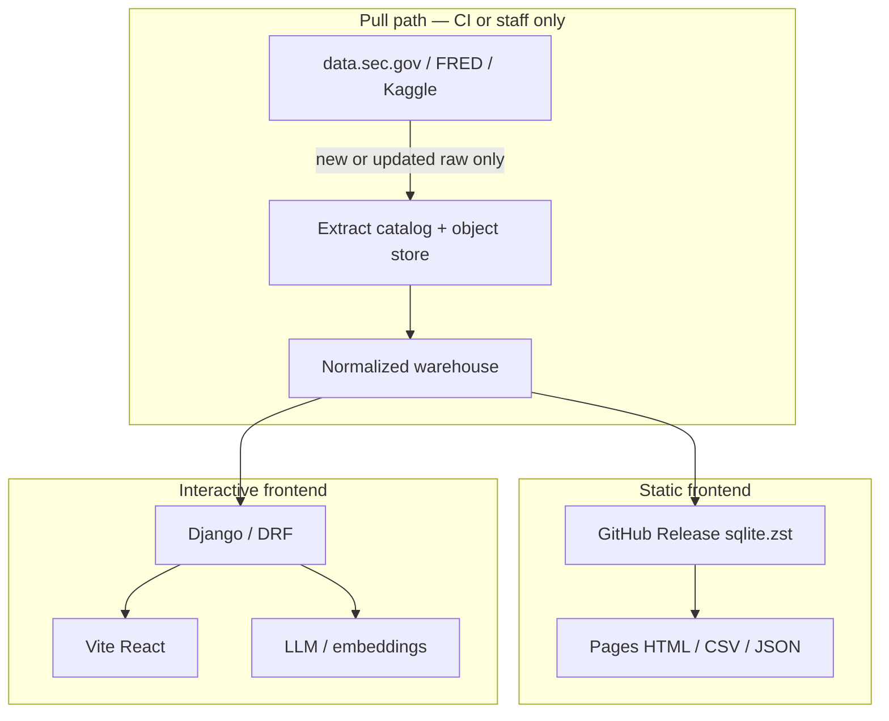

# Distributed extract storage — specification

**Status:** proposed (not implemented). This is the target design. Where it disagrees with the code, the code is current behavior and this document is the change we intend to make.

**Goal:** cache EDGAR and FRED extracts so we never re-download bytes we already have, can retrieve both *raw* (pre-processed) and *clean* (post-processed) artifacts without hitting the source, and publish a versioned clean snapshot to **Kaggle** plus a **local compressed backup**. A **bonus** path treats Kaggle as an *inbound* source too: identify, extract, and enrich complementary public datasets so the warehouse is rich on companies, industries, markets, and economies — without redundant downloads or inventing facts.

Related: [architecture.md](architecture.md) (today’s DB-first cache), [static-site.md](static-site.md) (GitHub Pages static mirror vs interactive app), [sec-reference/edgar-api.md](sec-reference/edgar-api.md) (fair access, bulk ZIPs).

## Why

SEC fair-access (≤10 req/s, `User-Agent` with contact email) and FRED’s 120 req/min cap make redundant pulls expensive and, at cohort scale, a block risk. Today we already try to be polite, but the cache is incomplete:

| What exists today | Gap |
|---|---|
| `EdgarSecPayload` JSON in the warehouse DB, keyed `(cik, kind)` | Blobs live in SQLite/Postgres. Hit → return whole payload; miss → live GET. No ETag / SHA / 304. |
| `force_refresh=True` | Means “ignore cache and always refetch.” Weekly [`refresh-data.yml`](../.github/workflows/refresh-data.yml) uses `--force-refresh`, so every ticker re-hits SEC even when unchanged. |
| `ListedIssuer` from `company_tickers.json` | Directory cache only; no content hash of the ticker file. |
| Content-addressed `sec_edgar.storage` (LOCAL / S3, SHA-1) | Filing *documents* only. Submissions JSON, companyfacts JSON, bulk ZIPs, and FRED responses are not in it. |
| `sync_series_incremental(..., days_back=3650)` | Sliding 10-year window, not “from last observation / last_updated.” Re-pulls history we already stored. |
| GitHub Release `fredgar-warehouse.sqlite3.zst` | Operational warehouse for Pages. Not a layered extract store; not Kaggle; mixes raw JSON cache with derived rows. |

The rule this spec encodes: **source HTTP is a last resort, and it only retrieves new raw bytes or a proven update of existing bytes.** Reprocessing never requires the network.

## Principles

1. **Bytes are identity.** Raw extracts are content-addressed (SHA-256). Identical body → same object, written once.
2. **Three stages, one catalog.** Raw, normalized, and clean are different objects. The warehouse DB holds the *catalog and query tables*, not multi-megabyte JSON blobs.
3. **Revalidate ≠ refetch.** `--force-refresh` becomes “ask the source if it changed” (conditional GET / `last_updated`), not “throw away the cache.”
4. **Derived is rebuildable.** Normalized rows and clean snapshots are functions of `(raw SHA, processor_version)`. Missing derived data is a reprocess, not a download.
5. **Publish only clean.** Kaggle and the local compressed backup ship documented, denormalized tables plus a data dictionary and attribution — not API keys, not bulk JSON dumps.
6. **Provenance.** Every clean row traces to a raw object SHA and a source URL.
7. **Two frontends, one extract plane.** GitHub Pages never talks to EDGAR, FRED, Kaggle, the extract store, or the API at request time. The local/cloud app is the only runtime that queries the warehouse and runs AI. The extract store feeds *builds* (static) and *syncs* (interactive) — it is not a third frontend.
8. **Kaggle is a satellite, not an oracle.** Inbound Kaggle rows become `Claim`s (enrichment) or `ExternalSeries` (macro). They never outrank EDGAR for identity or reported financials, and they never skip the extract catalog. Our own outbound clean snapshot is not an inbound source.

## Stages



| Stage | What it is | Mutability | Examples |
|---|---|---|---|
| **raw** | Exact response body from the source | Immutable once stored | `CIK0000320193` submissions JSON, companyfacts JSON, filing `.txt`/HTM, `company_tickers.json`, nightly bulk ZIP, FRED `series` + `observations` JSON |
| **normalized** | Relational warehouse | Rebuilt from raw | `Company`, `Filing`, `Fact`, `DerivedMetric`, `SeriesObservation`, `ListedIssuer` |
| **clean** | Publishable, documented tables | Versioned snapshot | `companies.parquet`, `facts.parquet`, `series_observations.parquet`, `data_dictionary.md` |

Raw is the cache that protects the sources. Normalized is the query warehouse: the **interactive** app reads it live; the **static** site is HTML baked from it at publish time. Clean is what researchers download (Kaggle / local backup) — neither frontend reads parquet at runtime.

## Distributed layout

One logical object, many locations. The catalog records every location; readers walk them in order and stop at the first hit.

**Read order:** local disk → object store (S3) → GitHub Release warehouse (normalized only) → source HTTP.

| Location | Backend | Holds | Role |
|---|---|---|---|
| **Working local** | `STORAGE_ROOT` (already `EDGAR_DATA_DIR/storage`) | raw + optional clean working copy | Dev and job scratch. Existing `LocalStorage`. |
| **Object store** | `STORAGE_BACKEND=s3` (existing `S3Storage`) | raw extracts; optional clean snapshots | Shared cache across machines / CI. |
| **GitHub Release** | `dataset` / `fredgar-warehouse.sqlite3.zst` | normalized warehouse (as today) | Serverless input to Pages. Not a raw blob store. |
| **Local backup** | `data/local/backups/` (gitignored) | `fredgar-extracts-YYYYMMDD.tar.zst` | Operator disaster recovery: catalog + clean, optionally raw. |
| **Kaggle** | versioned dataset | **clean only** | Public research snapshot. Attribution required. |

Key layout on local / S3 (prefix under `STORAGE_ROOT` or `S3_PREFIX`):

```
extracts/
  raw/
    edgar/submissions/cik=0000320193/<sha256>.json
    edgar/company_facts/cik=0000320193/<sha256>.json
    edgar/tickers/<sha256>.json
    edgar/bulk/submissions/<yyyy-mm-dd>-<sha256>.zip
    edgar/bulk/companyfacts/<yyyy-mm-dd>-<sha256>.zip
    edgar/filings/<sha1>                  # already written by store_content
    fred/series/<id>/<sha256>.json
    fred/observations/<id>/<sha256>.json
    kaggle/<owner>/<slug>/<version>/<sha256>.zip
  clean/
    <dataset_version>/
      companies.parquet
      filings.parquet
      facts.parquet
      derived_metrics.parquet
      series_observations.parquet
      data_dictionary.md
      ATTRIBUTION.md
      MANIFEST.json
```

Filing artifacts keep today’s SHA-1 keys so existing `FilingDocument.raw_key` rows stay valid. New JSON/ZIP extracts use SHA-256.

## Two frontends, one extract plane

Fredgar already ships two UIs over the same warehouse ([static-site.md](static-site.md)). The extract store does not add a third. It is the shared *data plane* behind both.

| | **Static** — GitHub Pages | **Interactive** — local or cloud |
|---|---|---|
| **Code** | `warehouse/templates/staticsite/` + `generate_site` | [`frontend/`](../frontend/) Vite/React → Django/DRF |
| **Host** | GitHub Pages (`pages.yml`) | Docker / nginx locally, or a cloud VM/PaaS with Postgres + Redis + optional S3 |
| **Runtime** | Plain HTML/CSS/JS. **No Django, no API, no extract store, no SEC/FRED HTTP.** | Backend required. Token/session auth; reads public, writes/sync staff-only. |
| **Data at request time** | Files already in the Pages artifact (`company.json`, `facts.csv`, `macro/*.csv`, pre-rendered HTML) | Warehouse DB (SQLite local, Postgres in cloud) via `/api/v1/` |
| **How it gets data** | Build job downloads `fredgar-warehouse.sqlite3.zst` and runs `publish_static_site --skip-sync` / `--all-warehouse` | Catalog → local/S3 extracts → (revalidate) source. On-demand sync actions and Celery jobs. |
| **AI** | **None at runtime.** If leadership narrative / stakeholder index was computed before publish, it is frozen into HTML. No LLM keys on Pages. | **Yes.** `ENABLE_AI_ANALYSIS`, embeddings, leadership analyzer — only here. Needs `anthropic` + credential. |
| **Freshness** | Snapshot of last successful `refresh-data.yml` (weekly + manual) | Live. Staff can revalidate a CIK; unchanged raw is not re-downloaded. |
| **Extract store role** | **Build input only** (via the Release warehouse). Pages workers must not `extract_pull`. | **Sync cache.** Local uses `STORAGE_ROOT`; cloud uses `STORAGE_BACKEND=s3` so multiple app workers share raw bytes. |



**Hard rules**

1. **Pages is offline.** `pages.yml` stays `--skip-sync`. A Pages build that calls EDGAR, FRED, Kaggle, or S3 for raw extracts is a spec violation. Bootstrap fallback (no Release yet) is the only exception, and it should die once `refresh-data.yml` has published a dataset.
2. **Only the refresh job and the interactive backend pull.** `refresh-data.yml` is the scheduled writer for the public cohort. The interactive app may pull *additional* CIKs or revalidate on staff action; those bytes land in the same catalog so the next refresh does not re-fetch them.
3. **AI stays off the static path.** No `CLAUDE_CODE_OAUTH_TOKEN` / `ANTHROPIC_API_KEY` in Pages or `refresh-data.yml`. Precomputed `LeadershipAnalysis` / stakeholder rows may ship as HTML; regenerating them is an interactive (or explicit CI) job that writes into the warehouse *before* `--skip-sync` render.
4. **Same services, different callers.** `build_company_context` already feeds both UIs. Extract read-through belongs in `get_submissions_payload` / FRED sync — the static generator never imports the HTTP clients.
5. **Cloud interactive ≠ Pages.** A hosted API replica uses Postgres + S3 extracts + Celery. It is not a substitute for Pages and must not be required for the public mirror to work.
6. **Cross-links stay presentation-only.** `STATIC_SITE_APP_URL` / `VITE_STATIC_SITE_URL` point humans at the other frontend. They are not data-loading URLs.

Local compressed backup and Kaggle are **operator/research** outputs. Neither frontend loads them. A cloud app restores from backup/`extract_import` (or S3) to *seed* its warehouse; Pages continues to consume only the Release SQLite.

## Catalog (warehouse)

New persisted state lives in `warehouse` (CI fails on missing migrations). Proposed model: `ExtractObject`.

```
ExtractObject
  source            edgar | fred | kaggle
  stage             raw | normalized | clean
  kind              submissions | company_facts | tickers | bulk_zip |
                    filing_document | series_info | series_observations |
                    kaggle_dataset | clean_snapshot
  identity_key      cik / series_id / accession / "company_tickers" /
                    kaggle owner/slug / version
  content_sha       sha256 (raw, clean) or processor digest (normalized)
  size_bytes
  content_type
  source_url
  etag              HTTP ETag when the source sent one
  last_modified     HTTP Last-Modified
  source_updated_at FRED seriess[].last_updated; SEC filingDate max; ZIP mtime
  fetched_at        last time we talked to the source (including 304)
  stored_at         last time bytes were written
  processor_version empty for raw; bump to invalidate derived
  parent_sha        derived → raw SHA that produced it
  locations         JSON list of URIs (file://, s3://, kaggle://, gh://)
  stale             bool — raw changed, derived not rebuilt yet
```

Unique on `(source, stage, kind, identity_key)` for the *current* object; previous SHAs remain as immutable blobs and can be retained for audit or garbage-collected later.

`EdgarSecPayload` remains during migration as a compatibility read-through: if no `ExtractObject` exists, serve the JSON field, then spill it to object storage and record the catalog row. After cutover, `payload` may be dropped or replaced with a pointer.

`EdgarEntitySyncState` stays as the per-company *normalized* cursor (`submissions_synced_at`, `facts_synced_at`). It is not the raw-bytes cache.

## Incremental fetch

Every pull answers two questions, in order:

1. **Do we already have the bytes?** Catalog hit with a stored object → return it. No HTTP.
2. **Did the source change?** Only if the caller asked to revalidate, the object is missing, or a staleness policy expired.

### EDGAR JSON (submissions, companyfacts, tickers)

```
get(kind, cik):
  obj = catalog.current(edgar, raw, kind, cik)
  if obj and not revalidate:
    return storage.get(obj.content_sha)          # no HTTP
  headers = If-None-Match / If-Modified-Since from obj, if any
  resp = SEC GET
  if resp.status == 304:
    obj.fetched_at = now; return stored bytes    # no write
  sha = sha256(resp.body)
  if obj and sha == obj.content_sha:
    obj.fetched_at = now; return stored bytes    # identical body
  store(resp.body); catalog.upsert(...); mark_stale(normalized for cik)
  return resp.body
```

`--force-refresh` / `?force_refresh=true` **revalidates**. It does not delete the cache first and it does not write on 304 / same SHA.

When the source does not send ETag/Last-Modified (common on `data.sec.gov`), revalidation is still a GET, but the SHA short-circuit avoids rewriting and avoids marking normalized stale. Optional cheap heuristic before GET: if `EdgarEntitySyncState.submissions_synced_at` is today and we are not in a scheduled refresh, skip.

**Bulk ZIPs** (`submissions.zip`, `companyfacts.zip`): at most one download per URL per UTC date. If the ZIP SHA matches the catalog, skip extract. Prefer bulk ZIP for bootstrap/backfill of many CIKs; per-CIK API only for the curated cohort’s incremental updates.

**Filings:** keep `store_content` (skip `put` when `exists(sha1)`). Ingest of an accession already in `Filing` + `FilingDocument` is a no-op unless `--reprocess`.

### FRED

FRED revises history, so “new points only” is not enough — we must notice `last_updated`.

```
sync(series_id):
  info_obj = catalog.current(fred, raw, series_info, series_id)
  info = get_or_revalidate(series_info)          # cheap
  last_updated = info.seriess[0].last_updated
  if obs_obj and last_updated <= obs_obj.source_updated_at:
    return 0                                     # no observations HTTP
  start = max_stored_observation_date - 1 period # catch revisions
  raw = fetch observations?observation_start=start
  store raw; upsert SeriesObservation for changed dates only
```

Replace today’s `days_back=3650` default with **cursor from last stored date** (first sync still uses a bounded history window). `ExternalSeries.last_synced_at` remains; `ExtractObject.source_updated_at` is the FRED `last_updated` we compared against.

### What never hits the source

- Recompute derived metrics, statements, leadership, static site.
- Enrichment `edgar_submissions` / `edgar_facts` / `fred` / `fred_deflator` when the catalog already has raw.
- Pages publish (`pages.yml` already `--skip-sync`).
- `extract_reprocess`, `extract_backup`, `extract_publish_kaggle`, `extract_kaggle_identify`.
- Kaggle inbound reprocess from a stored dataset zip (unchanged version).

## Processor version

Normalized and clean objects carry `processor_version` (semver string in code, e.g. `facts-v3`). Bumping it marks derived `stale` without touching raw. Jobs then rebuild from stored bytes.

Metric formulas in `data/reference/financial_model.json` already live outside the facts atomic block; a version bump here is what invalidates `DerivedMetric` and clean KPI tables.

## Clean snapshots

A clean snapshot is a **point-in-time export** of normalized tables, not a dump of raw JSON.

| File | Grain | Notes |
|---|---|---|
| `companies.parquet` | one row per CIK | ticker, name, SIC, HQ |
| `filings.parquet` | company × accession | form, dates, URL |
| `facts.parquet` | company × concept × period | XBRL; units preserved |
| `derived_metrics.parquet` | company × key × period | from `financial_model.json` |
| `series_observations.parquet` | series × date | FRED values + units + `source_url` |
| `data_dictionary.md` | columns | types, units, null meaning |
| `ATTRIBUTION.md` | — | SEC public data; FRED® attribution and terms |
| `MANIFEST.json` | files | SHA-256, row counts, `dataset_version`, git SHA, `processor_version` |

`dataset_version` = `YYYYMMDD` + short git SHA + processor version. Unchanged MANIFEST hashes → do not upload a new Kaggle version.

### Local compressed backup

```bash
cd src
python manage.py extract_backup --out ../data/local/backups/fredgar-extracts-YYYYMMDD.tar.zst
python manage.py extract_backup --clean-only --out ../data/local/backups/fredgar-clean-YYYYMMDD.tar.zst
```

Default archive: `MANIFEST.json` + catalog export + **clean/**. `--with-raw` adds the content-addressed raw tree (large; operator-only). Restore is “unpack + `extract_import`”; it must not call SEC or FRED.

`data/local/` stays gitignored.

### Kaggle

Clean tables only. No raw payloads, no bulk ZIPs, no secrets, no CRM/`data/local` proprietary files.

- Dataset slug TBD (e.g. `bamr87/fredgar-sec-fred-clean`).
- Each publish is a new dataset *version* with the changelog = MANIFEST diff (row counts, version, date).
- Skip publish when every file SHA matches the last version.
- `ATTRIBUTION.md` must include FRED® citation and a link to [FRED terms](https://fred.stlouisfed.org/legal/); SEC data is US government public information with a fair-access reminder for anyone who would re-crawl.

```bash
python manage.py extract_publish_kaggle --dataset bamr87/fredgar-sec-fred-clean
```

Requires `KAGGLE_USERNAME` / `KAGGLE_KEY` in the environment. Not used by Pages or either frontend.

## Bonus: Kaggle inbound — identify, extract, enrich

**Status:** proposed exercise / optional growth feature. Not required for the EDGAR/FRED cache. The interactive app is where this runs; Pages only sees the result after a warehouse refresh.

EDGAR covers US (and some foreign) *filers*. FRED covers *US* macro. That leaves a hole: private companies, non-US economies, industry taxonomies (GICS/NAICS), market context, and peer/market structure. Kaggle is a catalog of already-packaged public datasets that can fill those holes **if** we treat them as evidence, not as truth.

Goal of the exercise: a warehouse that is useful on **companies, industries, markets, and economies** — comprehensive where sources exist, silent where they do not, always cited.

```
gap in warehouse
    → identify candidate Kaggle datasets (allowlist)
    → extract_pull --source kaggle   # versioned zip, SHA, skip if unchanged
    → map files → Claim / ExternalSeries / PeerGroup
    → enrich_resolve                 # EDGAR still wins identity + reported facts
    → next Pages publish bakes it in
```

### Identify

Do not scrape Kaggle. Maintain an allowlist in committed reference JSON, e.g. [`data/reference/kaggle_sources.json`](../data/reference/) (new file when implemented):

| Field | Purpose |
|---|---|
| `slug` | `owner/dataset-name` |
| `theme` | `company` \| `industry` \| `market` \| `economy` |
| `license` | SPDX or dataset license string; ingest refused if unknown/non-redistributable |
| `join` | keys we can actually match: `cik`, `ticker`, `lei`, `isin`, `sic`, `naics`, `gics`, `iso2`, `fred_id`, `year` |
| `yields` | fields or series this dataset may propose |
| `macro_scope` | required for economy datasets (`domestic_us`, `us_proxy`, `country`, `global`) — same honesty rule as FRED |
| `notes` | why this dataset, known caveats |

`extract_kaggle_identify` is a **planner**, not a downloader. It compares allowlist themes against warehouse coverage (companies missing GICS, economies with no non-US series, industries with no peer set) and prints what *would* help. Humans edit the allowlist; the command never auto-adds a slug.

Selection tests (fail → not listed):

- License is documented and compatible with our outbound attribution.
- A stable join key exists. Name-only matching is not enough (Eaton / Eaton Vance).
- Upstream is citable (World Bank, IMF, OECD, ISO, a research release) — a “scraped Yahoo prices” dump is out.
- It does not duplicate EDGAR companyfacts or our own outbound `fredgar-sec-fred-clean` dataset (no circular ingest).
- It adds a *layer we lack*: taxonomy, non-US macro, market index membership, industry concentration — not a second copy of 10-K numbers.

Illustrative themes (slugs TBD at implement time; do not hard-code dead URLs):

| Theme | What we want | Join |
|---|---|---|
| **Company** | Extra identifiers, GICS, listing status, simple descriptors | ticker / CIK / LEI |
| **Industry** | NAICS↔SIC↔GICS maps, peer cohorts, concentration | SIC / NAICS / GICS |
| **Market** | Index membership, exchange, currency | ticker / ISIN / exchange |
| **Economy** | World Bank / IMF / OECD indicators that FRED does not cover (esp. non-US) | `iso2` + year; optional FRED id |

### Extract

Same incremental rule as EDGAR/FRED. Kaggle datasets are versioned; the API reports a current version number.

```
pull(owner/slug):
  meta = kaggle dataset metadata
  obj = catalog.current(kaggle, raw, kaggle_dataset, owner/slug)
  if obj and obj.identity version == meta.version and sha matches:
    return stored zip                               # no HTTP body
  zip = download
  if sha256(zip) == obj.content_sha:
    bump fetched_at; return                         # republished identical bytes
  store zip; catalog.upsert(version, sha, license)
  mark_stale(derived that listed this slug as parent)
```

Raw path: `extracts/raw/kaggle/<owner>/<slug>/<version>/<sha256>.zip`. Reprocess reads the zip; it does not call Kaggle. Pages and `extract_reprocess` never hit the Kaggle API.

### Enrich

A Kaggle file is not a warehouse row. One **provider per allowlist slug** (or a thin family: `kaggle_gics`, `kaggle_wdi`) in [`src/enrichment/`](../src/enrichment/), following [enrichment.md](enrichment.md):

- **A provider never writes to a record. It emits `Claim`s.**
- `verified=True` only when we checked a join key that EDGAR (or GLEIF, later) already established — a ticker that matches `ListedIssuer`, a CIK, an ISO-3166 code from `geo`. A fuzzy name hit is unverified.
- Precedence sits **below** `edgar_facts` / `edgar_submissions` / `edgar_issuer` (and FRED for US series). Kaggle can fill empty fields and can `contested`-flag disagreements; it cannot overwrite a filing.
- Economy series go through `public_data` (`ExternalSeries.provider="kaggle"` or `"worldbank"` with `metadata.kaggle_slug`) so `fred_deflator`-style joins stay warehouse-only and silent when observations are missing.
- Market/industry extras that are not claims (peer lists) become `PeerGroup` / `PeerGroupMember` with a `DataSource` row pointing at the extract SHA.

Interactive app: `enrich_run` / staff actions. Static site: whatever is already in the warehouse at `--skip-sync` time. AI may *narrate* Kaggle-backed fields on the interactive app only, with the same “no invented quotes / cite the claim” rule.

### Exercise (operator walkthrough)

Worked path once commands exist. All from `src/`. No Pages involvement.

```bash
# 1. What would help? (no downloads)
python manage.py extract_kaggle_identify --themes company,industry,market,economy

# 2. Human: add slugs + licenses + join keys to data/reference/kaggle_sources.json

# 3. Plan the pull (reuse vs new version)
python manage.py extract_plan --source kaggle

# 4. Fetch only new/updated dataset versions
python manage.py extract_pull --source kaggle --no-web-except-kaggle

# 5. Claims from stored zips — network forbidden
python manage.py enrich_run --dataset manufacturing --providers kaggle_gics,kaggle_wdi
python manage.py enrich_resolve --dataset manufacturing
python manage.py enrich_report --dataset manufacturing
python manage.py enrich_evidence --dataset manufacturing --name "Eaton Corporation"
```

Pass criteria for the exercise:

- Second `extract_pull` with unchanged Kaggle versions performs zero dataset downloads.
- `enrich_evidence` shows a Kaggle URL + extract SHA for every field that came from Kaggle.
- An EDGAR-reported revenue is unchanged when a Kaggle fundamentals file disagrees (`contested` at most).
- A non-US macro series carries `macro_scope=country` (or similar), never silently posed as FRED.
- `pages.yml` still does not call Kaggle. After `refresh-data.yml` (or a local publish) the static company page shows the new fields if the generator already renders them.
- Outbound `extract_publish_kaggle` attributes inbound Kaggle sources in `ATTRIBUTION.md` and does not re-upload their raw files.

## Commands (proposed)

Thin wrappers around services, same pattern as the rest of the repo. All from `src/`.

| Command | Purpose |
|---|---|
| `extract_plan` | Print what would be reused vs revalidated vs fetched. No writes, no HTTP beyond optional HEAD. |
| `extract_pull --source edgar\|fred\|kaggle` | Incremental pull. Default: catalog first, revalidate only when policy says so. |
| `extract_kaggle_identify` | Coverage vs allowlist; prints candidate slugs. No downloads. |
| `extract_pull --revalidate` | Conditional GET / FRED `last_updated` check for the cohort. Replaces `--force-refresh`. |
| `extract_reprocess --kind company_facts` | Rebuild normalized from stored raw. Network forbidden. |
| `extract_backup` | Local `.tar.zst` (see above). |
| `extract_import --from PATH` | Restore catalog + objects from a backup. |
| `extract_publish_kaggle` | Push clean snapshot if MANIFEST changed. |

Existing `sync_submissions` / `sync_company_facts` / `sync_series_bundle` / `publish_static_site --sync-only` keep their names; their services switch to the catalog read path. `--force-refresh` is documented as an alias of `--revalidate` and stops deleting cache hits.

`refresh-data.yml` changes from `--force-refresh` (always refetch) to `--revalidate` (304/SHA/last_updated). First bootstrap (empty catalog) still full-loads.

## Services

Business logic in services, not commands or views:

- Extend [`sec_edgar/storage.py`](../src/sec_edgar/storage.py) with SHA-256 keys and a shared `ExtractStore` used by EDGAR, FRED, and Kaggle inbound (no per-source filesystems).
- New `warehouse/services/extracts/` (or `sec_edgar/services/extract_store.py` + `public_data` adapter): catalog CRUD, read-through, revalidate, backup, Kaggle export *and* inbound versioned pull.
- Change [`edgar_sec_payload.py`](../src/sec_edgar/services/edgar_sec_payload.py) `get_*_payload` to the algorithm above.
- Change [`public_data/services/sync.py`](../src/public_data/services/sync.py) to the FRED cursor + `last_updated` skip.
- `SecEdgarClient.get_json` grows optional conditional headers and a 304 result. Tests use `responses`; no live network.

## Non-goals (this spec)

- Replacing Postgres/SQLite as the query warehouse.
- Putting CRM / enrichment golden records on Kaggle.
- Auto-ingesting arbitrary Kaggle search hits; inbound is allowlist-only.
- Treating Kaggle market prices or “fundamentals” dumps as a substitute for EDGAR `Fact`s.
- Ingesting our own outbound clean snapshot as if it were a third-party source.
- Scraping EDGAR HTML when JSON or bulk ZIP exists.
- Real-time streaming / PDS.
- Serving the interactive SPA from GitHub Pages, or calling `/api/v1/` from the static mirror.
- Running AI analysis inside `pages.yml`.
- Deduplicating GitHub Release SQLite with the extract tree in v1 — Release remains the Pages input; extracts are the source cache and research snapshot. A later phase may build the Release DB *from* clean+normalized without a live sync.

## Rollout

| Phase | Ship | Success |
|---|---|---|
| **0 — spec** | this document | — |
| **1 — catalog + SHA short-circuit** | `ExtractObject`; hash bodies; skip write on same SHA; FRED `last_updated` skip | Tests: 304/same-SHA → no `put`; FRED unchanged `last_updated` → no observations GET |
| **2 — spill blobs** | JSON/ZIP live in object storage; `EdgarSecPayload` read-through then pointer | Warehouse DB size no longer grows with payload JSON |
| **3 — revalidate** | `--force-refresh` → conditional GET; `refresh-data.yml` uses it | Weekly job’s SEC call count ≈ changed CIKs, not cohort size |
| **4 — local backup** | `extract_backup` / `extract_import` | Round-trip test from fixture, `requires_network` not needed |
| **5 — Kaggle out** | `extract_publish_kaggle` + attribution | Unchanged MANIFEST → no new version |
| **6 — Kaggle in (bonus)** | allowlist + identify + versioned pull + enrichment providers | Unchanged dataset version → zero download; EDGAR facts unchanged on conflict |

## Testing

- Mock SEC 200 then 304: second pull stores nothing, `fetched_at` moves.
- Mock identical body without ETag: SHA match, normalized not marked stale.
- FRED `last_updated` older than catalog: zero observations requests.
- `extract_reprocess` with `responses` asserting no outbound HTTP.
- Backup tar contains MANIFEST + clean files; import restores catalog keys.
- Existing payload tests keep passing via read-through until phase 2 drop.
- Kaggle inbound: same version → no download; new version + same SHA → no derived stale; EDGAR revenue claim wins over Kaggle fundamentals.

## License and attribution

- **SEC EDGAR** responses are US government public information. Caching and republishing *derived* tables is the point of this spec; crawlers of our Kaggle dataset must not treat it as a license to ignore SEC fair access if they go back to `data.sec.gov`.
- **FRED®** data remains subject to St. Louis Fed terms. Clean snapshots include `ATTRIBUTION.md` and `source_url` on every series. We do not strip units, rename series IDs, or omit the FRED citation.
- **Do not** publish `USER_AGENT_EMAIL`, `FRED_API_KEY`, or `KAGGLE_KEY`.
- **Inbound Kaggle:** honor each dataset’s license; cite `owner/slug` + version + upstream (World Bank, IMF, …) in `ATTRIBUTION.md` and on every claim’s `Evidence.url`. Skip datasets we cannot legally keep or republish.
